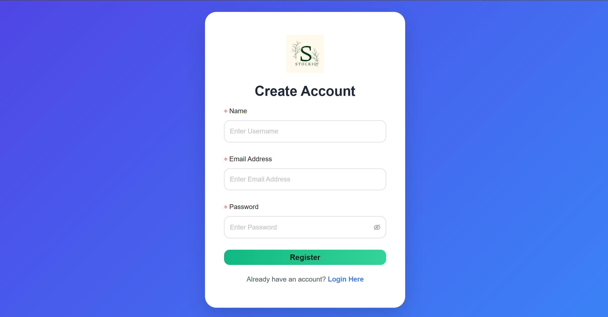
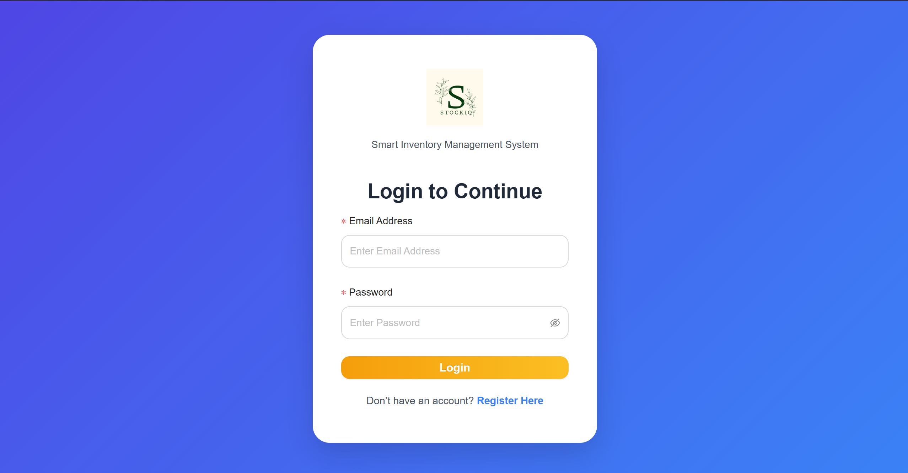
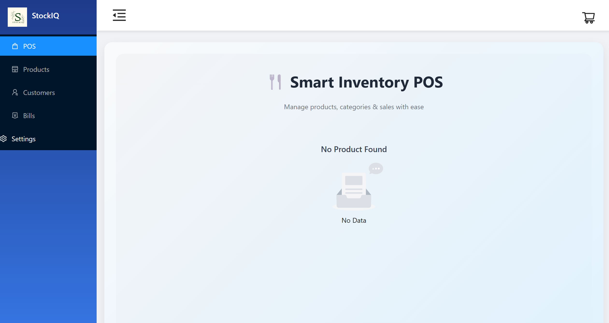
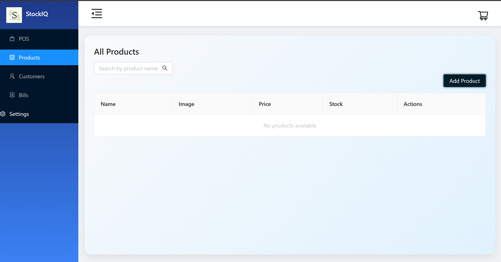
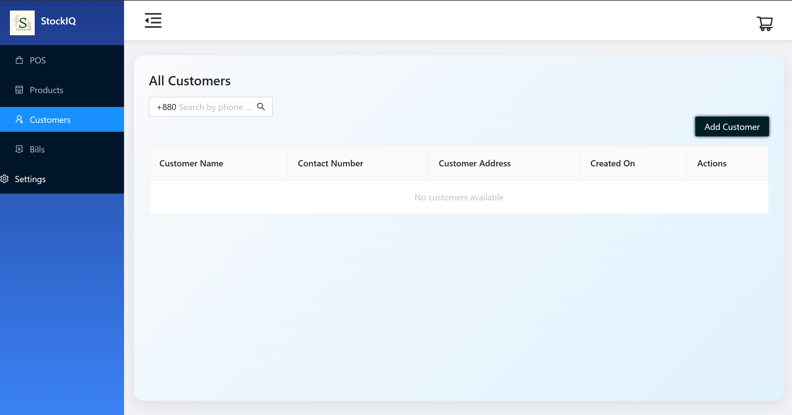
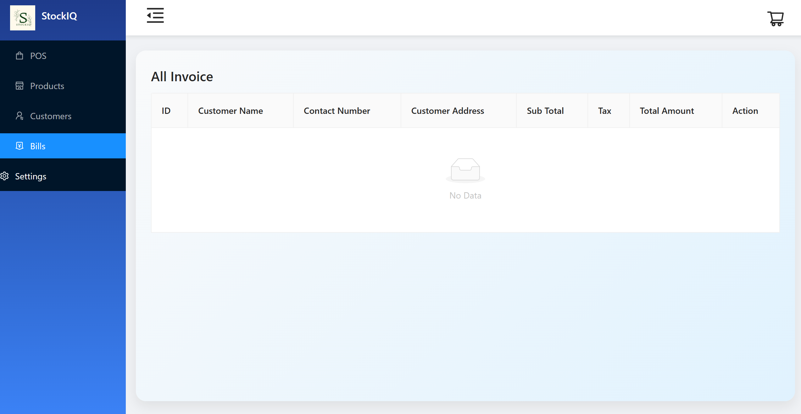
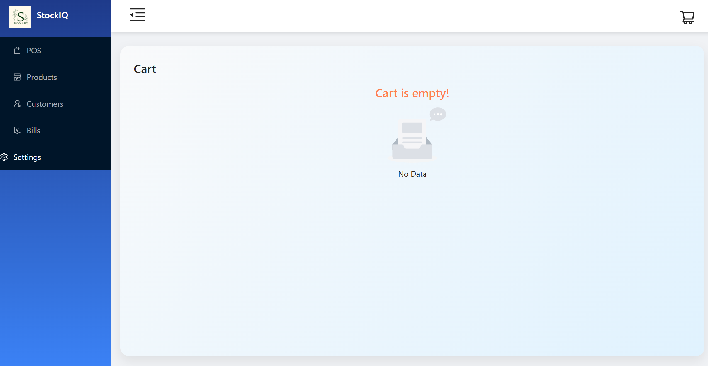

<!DOCTYPE html>
<html lang="en">
<head>
  <meta charset="UTF-8">
  <meta name="viewport" content="width=device-width, initial-scale=1.0">
</head>
<body>

  
  <h1 style="margin: 0; font-size: 28px;">StockIQ - Modern POS & Inventory Management System</h1>

A comprehensive Inventory Management System (IMS) and Point of Sale (POS) system built using the <strong>MERN (MongoDB, Express.js, React.js, Node.js)</strong> stack. This system provides a robust solution for managing sales, inventory, customers, and generating invoices.

<h2>🚀 Features</h2>

<h3>Product Management</h3>
<ul>
  <li>Add, edit, and delete products</li>
  <li>Real-time product search functionality</li>
  <li>Stock tracking with low stock alerts</li>
  <li>Product categorization</li>
  <li>Image support for products</li>
</ul>

<h2>🛠 Technology Stack</h2>
<ul>
  <li><strong>Frontend:</strong> React.js, Ant Design, Redux</li>
  <li><strong>Backend:</strong> Node.js, Express.js</li>
  <li><strong>Database:</strong> MongoDB</li>
</ul>

<h2>🚀 Getting Started</h2>

<h3>Prerequisites</h3>
<ul>
  <li>Node.js (v14 or higher)</li>
  <li>MongoDB</li>
  <li>npm or yarn</li>
</ul>

<h3>Installation Steps</h3>
<pre><code>git clone &lt;repository-url&gt;
npm install
cd client
npm install
</code></pre>

<h3>Configuration</h3>

Create a <code>.env</code> file in the root directory:

<pre><code>MONGO_URI=your_mongodb_connection_string
JWT_SECRET=your_jwt_secret
PORT=8080
</code></pre>

<h3>Running the Project</h3>
<pre><code>// Backend
npm run server

// Frontend
cd client
npm start
</code></pre>

<h2>📝 Usage</h2>
<ul>
  <li>Register/Login to access the dashboard</li>
  <li>Add products to your inventory</li>
  <li>Manage customers</li>
  <li>Create sales and generate invoices</li>
  <li>Track your business performance</li>
</ul>

<h2>📂 Suggested File Structure</h2>
<pre>
StockIQ/
│
├── backend/                 # Node.js + Express server
│   ├── controllers/         # Business logic
│   ├── models/              # Mongoose schemas
│   ├── routes/              # API endpoints
│   ├── middleware/          # Authentication & validation
│   ├── utils/               # Helper functions
│   ├── config/              # DB connection & env setup
│   └── server.js            # Entry point
│
├── client/                  # React frontend
│   ├── src/
│   │   ├── components/      # Reusable UI elements
│   │   ├── pages/           # Pages (Dashboard, POS, Inventory, Customers)
│   │   ├── redux/           # State management
│   │   ├── services/        # API calls (Axios)
│   │   ├── assets/          # Images, icons
│   │   └── App.js           # Root component
│   └── package.json
│
├── Images/                  # Screenshots & logo
│
├── .env                     # Environment variables
├── README.html              # Documentation
└── package.json
</pre>

<h2>📸 Screenshots</h2>

  
  
  
  
  
  
  
  

<h2>✅ Conclusion</h2>

The <strong>StockIQ</strong> system delivers a complete solution for managing inventory and sales with ease. 
By combining the power of the <strong>MERN stack</strong>, it ensures a fast, reliable, and scalable platform for businesses of any size. 
With features like real-time stock tracking, smart cart management, customer handling, and professional invoice generation, 
StockIQ simplifies day-to-day operations and improves business efficiency. 
Future enhancements could include advanced analytics and integration with external systems for even greater business insights.

</body>
</html>
